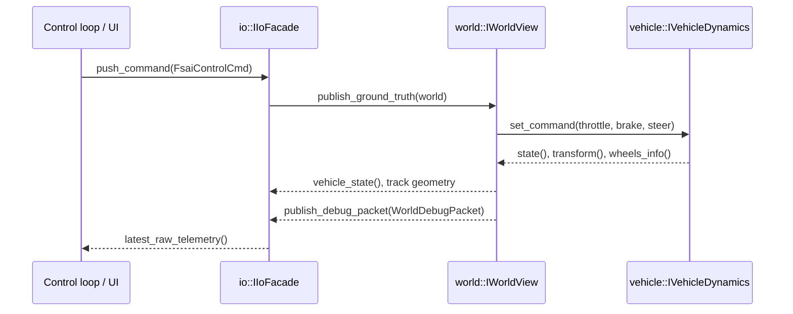
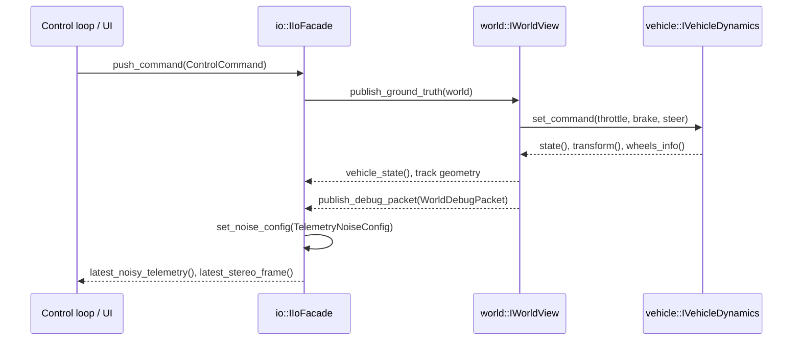

# Command and telemetry boundaries

The new boundary interfaces (`world::IWorldView`, `vehicle::IVehicleDynamics`, `io::IIoFacade`) clarify how control, dynamics, and rendering exchange data without sharing mutable state. IO is the only conduit that both control and perception touch; the world exposes ground truth solely to IO (for telemetry/stereo frames) and to vehicle dynamics (for stepping physics).

## Command/telemetry loop (no noise)

## Command/telemetry loop (noise-enabled)

These sequences highlight the dependency direction: control and perception communicate only through IO, while the world remains the source of truth for both physics and rendered sensor products.
